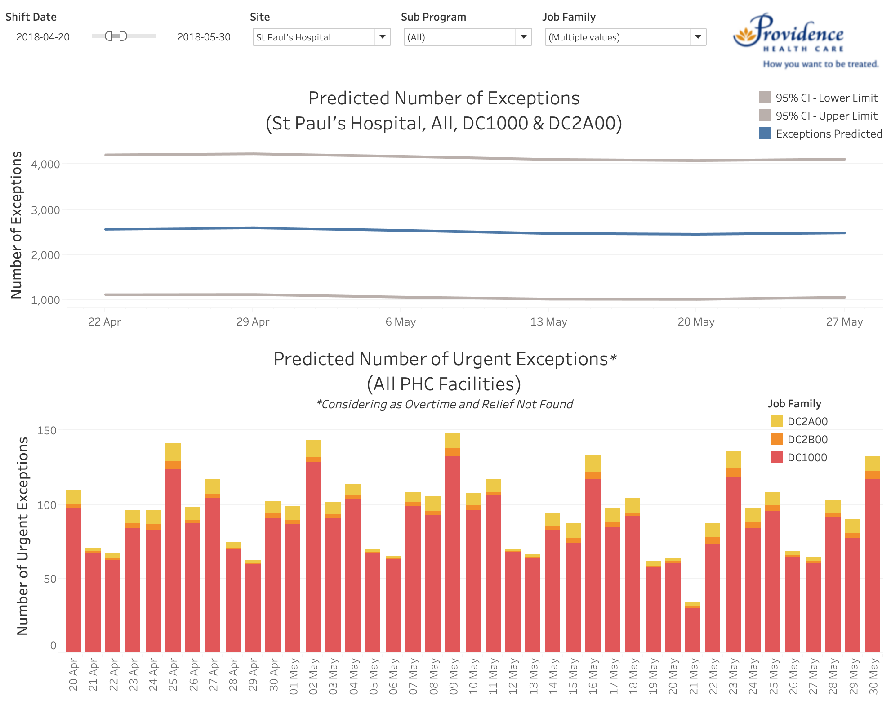
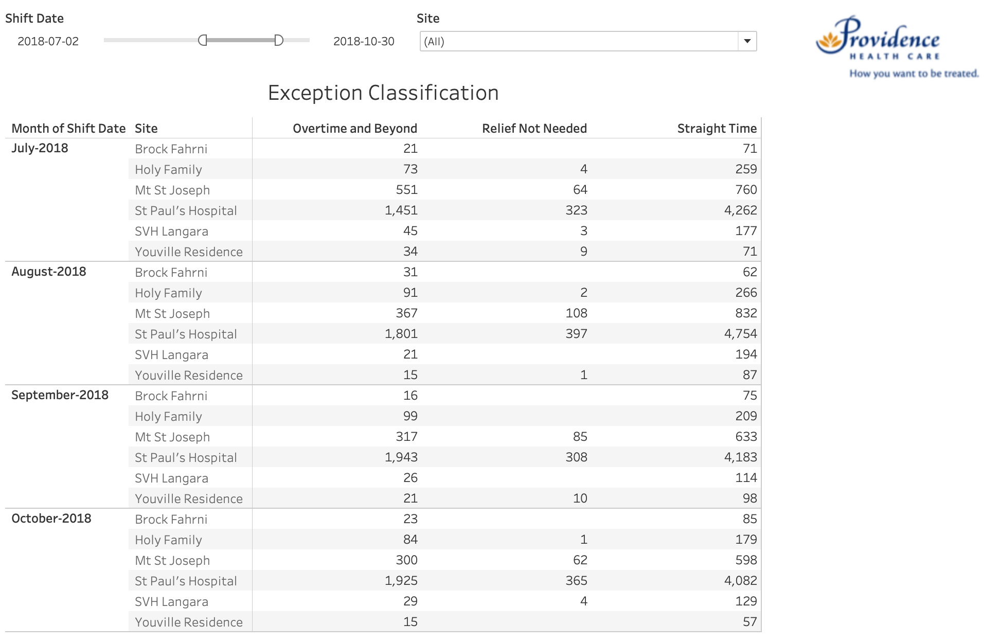

# Forecasting of Staffing Needs in Health Care

## Contributors:

Team Members:
- [Marcelle Chiriboga](https://github.com/mchiriboga)
- [Weifeng (Davy) Guo](https://github.com/DavyGuo)
- [Patrick Tung](https://github.com/tungpatrick)
- [Luo (Iris) Yang](https://github.com/lyiris22)

Mentor:
- [Rodolfo Lourenzutti](https://github.com/Lourenzutti)

Partner:

- Providence Health Care


## Summary


The purpose of the project was to help the People Analytics and Innovation Team from Providence Health Care (PHC) to predict the short-term staff needs in order to prepare for unexpected potential costs and staff shortages. The predictions are made based on the historical records of scheduled exceptions, i.e. staff absences due to unexpected or previously arranged reasons such as sick time, vacation, maternity leave, etc. Specifically, the data product developed has four components - three predictive models and a dashboard.

## Milestones:
 |Deliverable|Link|
 |---|---|
 |Proposal Presentation|[RISE presentation](https://github.com/UBC-MDS/DSCI_591_capstone-Providence/blob/master/doc/1.Proposal_Presentation.ipynb)|
 ||[.pdf slides](https://github.com/UBC-MDS/DSCI_591_capstone-Providence/blob/master/doc/2.Proposal_Presentation.pdf)|
 | Proposal Report |[rendered .pdf](https://github.com/UBC-MDS/DSCI_591_capstone-Providence/blob/master/doc/4.Proposal_Report.pdf)|
 |Final Presentation|[RISE presentation](https://github.com/UBC-MDS/DSCI_591_capstone-Providence/blob/master/doc/5.Final_Presentation_slides.ipynb)|
 ||[.pdf slides](https://github.com/UBC-MDS/DSCI_591_capstone-Providence/blob/master/doc/6.Final_Presentation.pdf)|
 |Final Report|[.Rmd](https://github.com/UBC-MDS/DSCI_591_capstone-Providence/blob/master/doc/7.Final_Report.Rmd)|
 ||[rendered .pdf](https://github.com/UBC-MDS/DSCI_591_capstone-Providence/blob/master/doc/8.Final_Report.pdf)|

## Setup
To install all the necessary packages, please navigate to the root directory and install the necessary packages through the following codes:

If you are using Mac, please open `Terminal` and enter the following:
```
chmod +x setup.sh
./setup.sh
```

If you are using Windows, please open any command prompt window and enter the following:
```
sh setup.sh
```

## How to use

### Exception Count Prediction Tool:
This tool allows you to train your data and predict the number of exceptions for a given timeframe. The predicted data will be outputted into a directory under `/data/predictions/`. The predicted file would be called `predictions.csv`. To use this tool, please enter the following into terminal or command prompt:

```
cd src
python exception_prediction_gui.py
```
You can then select the file you want to train with (i.e. `exception_hours.csv`), and input the start and end date of the prediction timeframe.

### Urgent Exception Prediction Tool:
This tool allows you to train your data an predict the number of urgent exceptions, given the productive hours of the period you want to predict. The predicted data will be saved in `/data/predictions`. The predicted file would be called `urgent_predictions.csv`. To use this tool, please enter the following into terminal or command prompt:

```
cd src
python urgent_prediction_gui.py
```

You will need a file of exception hours and a file of productive hours for past years as training data. Also you will need a file of productive hours for the period you want to predict, which can be an estimation.

### Exception Classification Tool:

The exception classification tool allows users to wrangle both `training data` and `exception data`, then use them to predict possible `EARNING_CATEGORY` for each exception. The predicted file would be called `classification_result.csv`. To use this tool, please enter the following into terminal or command prompt:

```
python src/Exception_Classification.py --raw_data_path="data/user_specified_training_data.csv" --exception_data_path="data/user_specified_exception_data.csv" --output_data_path="data"
```

You will need to specify the file containing historical data of exceptions for training data, and also the file of exceptions waiting to be fulfilled.

### Dashboard

The dashboard was developed using Tableau, consolidating the three models.





The dashboard .twb file can be found [here](https://github.com/UBC-MDS/DSCI_591_capstone-Providence/blob/master/src/phc_dashboard.twb) and uses as input the .csv outputs from the three models mentioned above, stored in [src/](https://github.com/UBC-MDS/DSCI_591_capstone-Providence/tree/master/src).

Tableau doesn’t support relative paths, meaning every data source connection in a .twb file points to an absolute path. So after cloning or forking the repo, the users will need to update the data source connections in their local machine when they first open the dashboard, ensuring the data source paths point to the correct files on their computer. For that, follow the instructions described [here](https://onlinehelp.tableau.com/current/pro/desktop/en-us/connect_basic_replace.htm).
