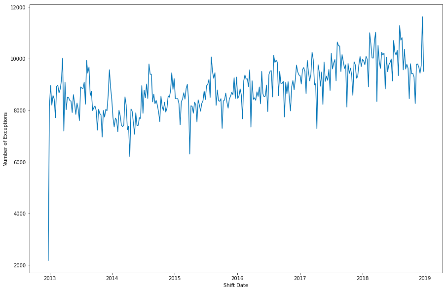
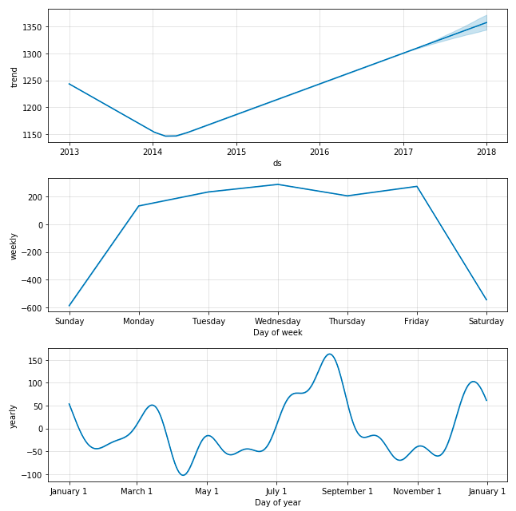
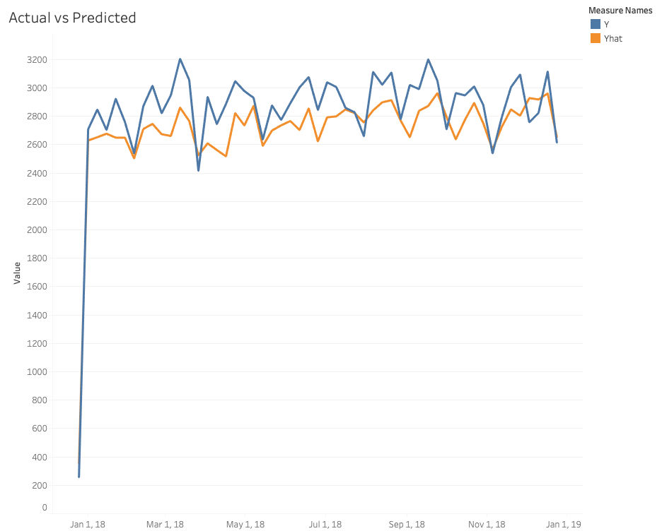
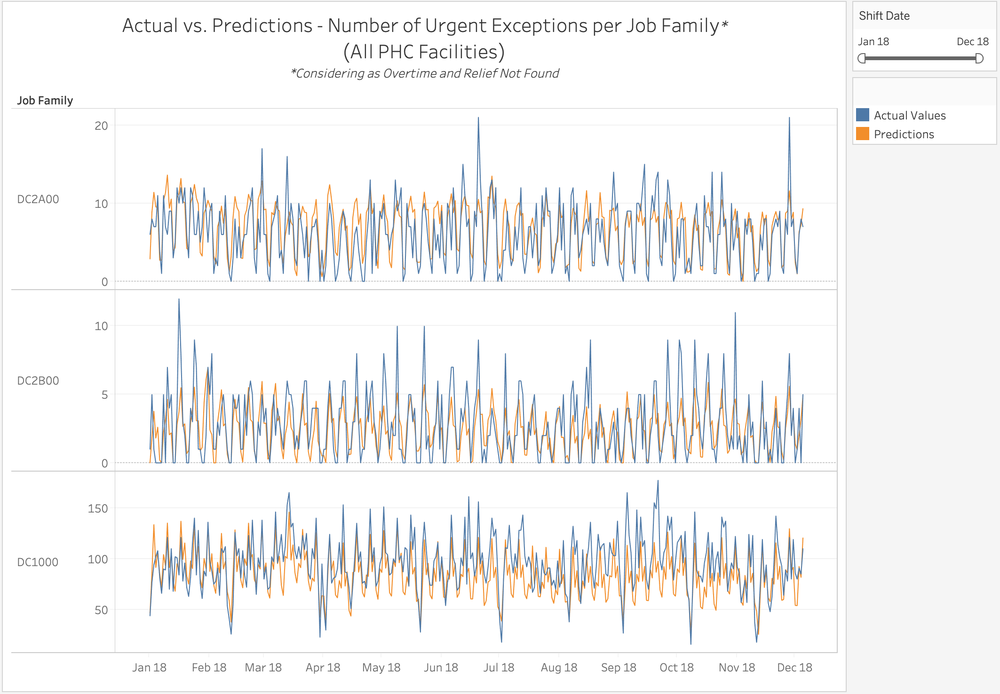
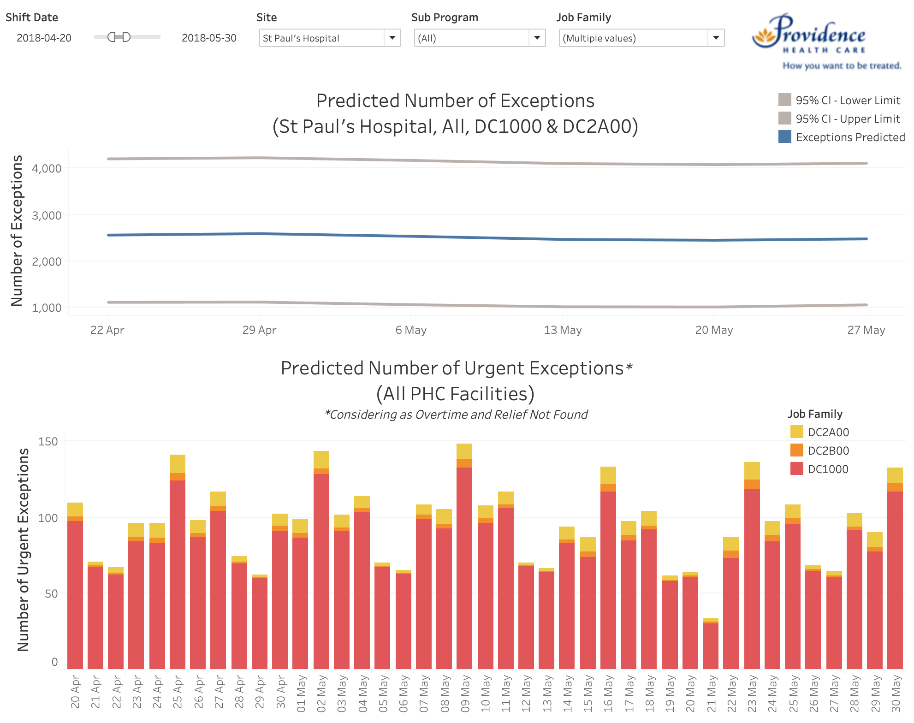
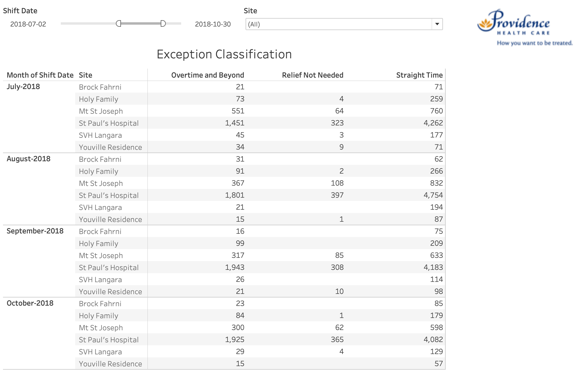

```{r setup, include=FALSE}
knitr::opts_chunk$set(echo = FALSE)
suppressPackageStartupMessages(library(tidyverse))
suppressPackageStartupMessages(library(qcc))
```

## Executive Summary

For most positions in the health care business, any staff absences must always be filled in by another staff and the costs of substituting absences with short notice are usually significantly higher than regular staffing. Hence, preparing for potential shortages by predicting the short-term staffing needs can significantly improve the operational efficiency of health care institutions.

The purpose of the project was to help the People Analytics and Innovation Team from Providence Health Care (PHC) to predict the short-term staff needs in order to prepare for unexpected potential costs and staff shortages. The predictions are made based on the historical records of scheduled exceptions, i.e. staff absences due to unexpected or previously arranged reasons such as sick time, vacation, maternity leave, etc. Specifically, the data product developed has four components - three predictive models and a dashboard.

## Introduction

An increase in patients' waiting time at hospitals or the postponement of important procedures, such as surgeries, are known to be critical, which is why medical institutions try to make sure that their clinical positions have backups whenever possible. On the other hand, more than 70% of the operational costs in health care are tied to staffing and, overstaffing can result in a significant increase in these costs.

PHC is a government agency that operates more than 16 healthcare facilities in British Columbia, with almost 7,000 staff, including 1,000 medical staff. At their scale, under or over staffing can have significant impacts both in terms of cost to the organization and in quality of care provided to patients, and for this reason, accurately forecasting staffing needs can have a very positive impact.

In this project, we partnered with PHC to predict staff needs based in their historical exception records, focusing our predictions on the *operational level*, i.e. short term needs, specifically on a time horizon of less than a month. The goal was to answer the question: _"How should PHC prepare for their weekly staffing needs in order to effectively operate with a full staff?"_, giving them more time to handle the exceptions. More specifically we focused on building models for:

- Forecasting staffing needs on a weekly basis, allowing PHC to estimate how many back up staff are needed per site, subprogram, and job family;
- Forecasting how many exceptions will fall under the urgent groups (i.e. overtime and relief not found), so PHC can be better prepared to find relief for critical exceptions;
- Classifying each exception logged on PHC's internal system in one of three possible categories, allowing PHC to prioritize which exceptions to pay extra attention to in finding relief for.

## Data Science Methods

### EDA

Before setting out to develop the prediction models, the first step in the project was to carry out an exploratory data analysis to have a better understanding of the dataset, which consisted of historical data of PHC's exception hours since the end of 2012.

```{r load training data, include = FALSE}
# Load the exception hours data
exception_hours <- read_csv("../data/train.csv")
```

Exploring how the exceptions are distributed among the PHC facilities, it was clear that St. Paul’s Hospital is the main contributor, with about 5 times as many exceptions as the second one.

```{r facilities rank}
# Check the total number of exceptions by facilities
(facilities <- exception_hours %>% 
  group_by(SITE) %>% 
  filter(SITE %in% c("Billable", "Brock Fahrni", "Holy Family",
                     "Mt St Joseph", "PHC Corporate", "St John Hospice",
                     "St Paul's Hospital", "SVH Honoria Conway", "SVH Langara",
                     "Youville Residence")) %>%
  summarise(count = n()) %>% 
  arrange(desc(count))
 )
```

Performing a similar analysis to look at the distribution across the different labour agreements, faceting by facilities, it is evident that `NURS` are the group with the most exceptions.

```{r number of exceptions by labor agreement}
# Visualize the total number of exceptions by labor agreement facetting by site
exception_hours %>%
  filter(!(LABOR_AGREEMENT %in% c('NULL', '0')), SITE %in% c("Billable", "Brock Fahrni",
                                                             "Holy Family", "Mt St Joseph",
                                                             "PHC Corporate",
                                                             "St John Hospice",
                                                             "St Paul's Hospital",
                                                             "SVH Honoria Conway",
                                                             "SVH Langara", 
                                                             "Youville Residence")) %>%
  ggplot(aes(x = LABOR_AGREEMENT, fill = LABOR_AGREEMENT)) +
  geom_bar(stat = "count") +
  facet_wrap(~SITE) +
  theme_bw() +
  ggtitle("Number of Exceptions by Labor Agreement per Site (2013 - 2017)") +
  theme(plot.title = element_text(hjust = 0.5)) +
  theme(axis.text.x = element_text(angle = 30, hjust = 0.5, vjust = 0.5)) +
  labs(x = "", y = "Count", fill = "")
```

Finally, based on a Pareto chart displaying the different types of `NURS`, it was decided that the models should focus on the top 3 job families, which represent almost 96% of the total exceptions within this group.

```{r Expand NURS LABOR_AGREEMENT, echo=FALSE, results='hide', fig.keep='all'}
# NURS job families
nurs_job_family <- exception_hours %>% 
  filter(LABOR_AGREEMENT == "NURS") %>%
  group_by(JOB_FAMILY_DESCRIPTION) %>% 
  summarise(count = n()) %>% 
  arrange(desc(count)) %>% 
  mutate(cumsum = cumsum(count),
        freq = round(count / sum(count), 3),
        cum_freq = cumsum(freq))

# Plot pareto
nurs_job_family_count <- nurs_job_family$count
names(nurs_job_family_count) <- nurs_job_family$`JOB_FAMILY_DESCRIPTION`
pareto.chart(nurs_job_family_count, cumperc = seq(0, 100, by = 25), main = "Pareto chart for NURS job families")
```

### Exception Count Predictions

To begin with the predictions of exception count, because we had to make sure that we did not overfit our model when training, we first split our data into three separate portions: training, validation, and testing. The training dataset consisted of data from 2013 to 2016. 2017 and 2018 were the datasets for validation and testing respectively. As all analysis should start, we performed some exploratory data analysis. First, we plotted out the number of exceptions.



As you can see from the above EDA, we can see that there seems to be some sort of pattern to the number of exceptions throughout the years, so we explore it as a time series data. As you can see, we have decomposed the data into the trend and seasonality portions.



Given the temporal nature of the data, we attempted to model this problem using regression, time series analysis, and even neural networks . We then tried to fit different time series models using techniques and tools such as seasonal decomposition and Facebook’s open source tool called Prophet. Ultimately, we chose to move forward with Facebook's Prophet tool. Not only did the model provide the best results when comparing it with our validation set, it was also one of the easier models to implement on a large scale.

Because our goal is to provide PHC with more actionable predictions, providing a forecast of an aggregate exception count for the whole of PHC is not effective. For this reason we decided to group our models into specific combinations of SITE and JOB_FAMILY. However, several of these combinations have very little exceptions for our model to capture any meaning, Therefore, we chose to focus only on the largest six health care facilities, which are: St Paul’s Hospital, Mt St Joseph, Holy Family, SVH Langara, Brock Fahrni, and Youville Residence. In regards to JOB_FAMILY, we chose to focus only on nurses, but specifically the top 3 nurses: DC1000, DC2A00, DC2B00.

To tune our models, we took a look at the Mean Absolute Error. The MAE provides a clear image for us to see how many exceptions we have predicted incorrectly averaged on a weekly basis. Overall, our MAE for our validation set and testing set were 118.42 and 131.57 respectively. Given that there are thousands of exceptions occurring each week, this MAE is fairly small and the predictions of the model can facilitate management to make better decisions in regards to staffing. In terms of the errors for each facility, for the year 2018, we had the following MAEs:

<center>

| SITE | MAEs |
| --- | --- |
| St Paul's Hospital | 120.48 |
| Mt St Joseph | 40.69 |
| Holy Family | 17.54 |
| Brock Fahrni | 8.98 |
| Youville Residence | 6.23 |
| SVH Langara | 12.42 |

</center>

The graph below is a visualization of the Actual Exception Count vs Predicted Exception Count as a whole for Providence Health Care:



### Urgent Exception Predictions

Besides predicting the total count of exceptions, we also focused on the number of urgent exceptions, which are backfilled by "overtime" and "relief not found". According to the backfilling strategies in PHC, "overtime" is the last solution to consider due to the high cost it brings. If no backfill is available, the exception will be marked as "relief not found". We want to forecast approximately how many urgent exceptions PHC will have, giving HR an insight so that they can make any arrangements beforehand to minimize costs.

We used linear regression instead of time series for this part due to higher accuracy. We removed data from 2014 from the training set because the pattern is very different compared to the years after. Similarly, we also consider only the top three nurse groups, which are `DC1000`, `DC2A00` and `DC2B00` in `JOB_FAMILY` in the original data. We did not split by sites as in the previous section, since PHC mentioned that they are working on the system to switch shifts among different sites, and they prefer to receive a general overview that consider all sites as a whole. Thus, we provide the total count of predictions for all sites.

The predictors of the linear regression model are shift dates and productive hours. Shift dates are transformed into one-hot encoding, considering day of week, day of month, week of year and month of year. For the productive hours, even though we do not have the exact data for the future periods, we can provide estimations according to shift arrangements. A graph of testing result for this model is shown below.



For some peaks in the daily basis, the linear model is not able to predict them accurately due to random events. The problem becomes more obvious in the groups with smaller counts like `DC2B00`. We expect that the model can be improved by providing more features, perhaps even new variables related to the operation for each hospital. However, the model provides satisfiable predictions in general. The Mean Absolute Error for each group of 2018 is listed below.

<center>

| JOB_FAMILY | MAEs |
| --- | --- |
| DC1000 | 18.35 |
| DC2A00| 3.79 |
| DC2B00 | 2.19 |

</center>

### Exception Classification

The two predictive models can help PHC plan relief ahead, but for the exceptions which have already been recorded in their internal systems, we can also generate some insights to help HR prioritize how to handle the exceptions, avoiding unnecessary costs. Hence, we developed a classification model which uses random forest classifiers to predict the most likely outcome for a given exception.

Our classification model outputs categories corresponding to the `EARNING_CATEGORY` variable. Originally, there were 12 possible categories, which were grouped into the following 3 labels:

- *Straight Time:* which contains all sorts of straight time reliefs. For this category, the pay rate is the same as the normal rate, so finding relief for these exceptions doesn't incur extra costs. Exceptions with `EARNING_CATEGORY` matching the following values were grouped into this label: `Regular Relief Utilized`, `Casual at Straight-Time`, `PT Over FTE`, `Miscellaneous Straight-Time`, `PT Employee Moved - Straight-Time`, `FT Employee Moved - Straight-Time`.

- *Overtime and Beyond:* which contains `Relief Not Found` and all kinds of relief which need to be paid more than the normal rate, which results in extra costs and thus should be avoided. Exceptions with `EARNING_CATEGORY` matching the following values were grouped into this label: `Overtime`, `Agency`, `Insufficient Notice`, `On-Call`, `Relief Not Found`.

- *Relief Not Needed*: which contains exceptions that don't need relief. Only exceptions with `EARNING_CATEGORY` matching `Relief Not Needed` are mapped to this label. 

For feature selection, we applied the forward selection method. We used `EXCEPTION_HOURS`, `NOTICE` (i.e. staff response time), and `EXCEPTION_CREATION_TO_SHIFTSTART_MINUTES` to set up the accuracy baseline for the model. Then, we added other features to see if it could increase the model accuracy. After several rounds of selection, we ended up adding the following features to our model: `SITE`, `PROGRAM`, `SUB_PROGRAM`, `EXCEPTION_GROUP`, `MONTH`, `DEPARTMENT`, and `SHIFT`.

After evaluating the model against the validation set, we found that even though the overall accuracy was 0.841, the accuracy for `Straight Time` category was much higher than the other two. This is due to the fact that the the data was imbalanced, with the training set containing many more examples that fall into the `Straight Time` category - almost 3x as much as the other two combined. Since exceptions that fall under the `Overtime and Beyond` category are the ones with the most impact to the business, it's important that the model predict those with higher accuracy. Thus, we updated our model's training to account for the imbalance, which in the end resulted in accuracies that are slightly lower overall, but which are more higher for the most critical categories, as seen in the table below.

<center>

| | Original Validation | Adjusted Validation | Adjusted Test |
|--------------------|:-------:|:-------:|:-------:|
| Overall | 0.841 | 0.794 | 0.800 |
| Straight Time | 0.936 | 0.823 | 0.830 |
| Overtime and Beyond| 0.638 | 0.735 | 0.756 |
| Relief Not Needed| 0.308 | 0.625 | 0.633 |

</center>

## Data Product and Results

### Exception Count Predictions

The Exception Count Prediction Tool is delivered through a script that generates a user interface that is easy to use. The interface can be run on both Windows computers and Mac computers, and it uses the same code to run. The interface has two parts, the top asks for the user to input the training data, which is the raw `exception_hours.csv` file that PHC has provided us. After including the correct type of data, the user will need to input a prediction timeframe. After clicking "Submit", our time series models will run and generate a `.csv` file that would provide all the relevant predictions regarding the number of exceptions Providence Health Care would have within the prediction timeframe.

### Urgent Exception Predictions

The Urgent Exception Prediction Tool is also delivered through a script that generates a user interface similar with the Exception Count Predictions. It requires a file of exception hours and a file of productive hours for past years as training data, as well as a file of productive hours for the period to predict, which can be an estimation. The output is a `.csv` file with prediction results in the given time period.

### Dashboard

We implemented the dashboard using Tableau, where we consolidated the three models. It has three different tabs:

- Predictions

The Predictions tab displays two charts stacked vertically.

The top chart shows how many exceptions are being predicted in a weekly basis by different sites, job families, and sub-program. The orange series corresponds to the predicted numbers of exceptions, while the grey ones represent the 95% confidence interval.

The bottom chart displays how many urgent exceptions, which includes overtime and relief not found, are being predicted. The different bar colors correspond to different job families.



- Exceptions Classification

The Exceptions Classification tab displays a summary table, where the user can easily see how many exceptions of each label is already on PHC's system. The user can filter by date and site.



- Productive vs. Exception Hours

The Productive vs. Exception Hours tab displays a comparison between the productive and exception hours based on historical data. The user can filter by date, site, and job family.


## Conclusions and Recommendations

Using the three data products developed, we are able to provide Providence Health Care with the insights they need to answer the question that was posed at the start of the project: _"How should PHC prepare for their weekly staffing needs in order to effectively operate with a full staff?"_. Not only the data products provide classifications and forecasts of PHC's exceptions, they can also help plan for the short-term and long-term staffing needs. However, it's important to note that the models are independent and the frequency with which they should be updated will depend on how PHC will use each of them.

In regards to the Exception Count and the Urgent Exception Predictions, the forecasts can remain accurate for an extended period without re-training (approximately 6 months). So, it is not necessary for PHC to re-train the models every day or even every week; but, there's an accuracy gain to be had by periodically re-training the model, adding more recent data. Thus, we recommend that PHC re-train the models once every month.

As to the Exception Classification, the model was trained on all exceptions logged in PHC's internal systems. The model does not require periodic re-training to stay accurate, but it's important to run the classifier for newly logged exceptions to obtain their respective classifications. The frequency should be determined by PHC based on their needs, but it'll likely need to be more than once a month.

Finally, for the prediction models, we focused only on the top 3 nurse job families (i.e. DC1000, DC2A00, and DC2B00). In order to also be able to make predictions for other groups, it's important to continue to gather data so the models can be expanded by training with these new observations. With the amount of data currently available, including the other groups – as well as taking into account other variables, such as department – has a negative impact in the models overall accuracies. This is the most significant improvement opportunity.

\newpage

## Appendix

- Exception Predictions

The graph comparing the actual and predicted exception counts in our report uses a result `.csv` that contains both the actual and predicted number of exceptions of 2018 on a weekly basis. To reproduce the dataframe, you need to specify the data for the exception hours in the `data folder, and then run the following command in the `src` folder:

```
python exception_prediction_result.py ../data/exception_hours.csv
```

The `exception_prediction_result.py` script uses the same method of prediction as in the user interface script `exception_prediction_gui.py`, but it adds the true value in order to make the comparison. The graph can be generated within Tableau using the output result dataframe. 

- Urgent Exception Predictions

The graph comparing the actual and predicted urgent exception counts in our report uses a result `.csv` containing the predicted and true number of urgent exceptions in 2018. To reproduce the dataframe, you need to have the data of exception hours and productive hours in the `data` folder, then run the following command in `src` folder:

```
python urgent_test_result.py ../data/exception_hours.csv ../data/productive_hours.csv
```

The script `urgent_test_result.py` uses the same method of prediction as in the user interface script `urgent_prediction_gui.py`, but adds the true data in order to make comparison. The graph can be generated in Tableau using the output result dataframe.

- Exception Classification

The dataframe containing test result that is shown in Tableau contains the predicted values of test data in 2018. To reproduce the dataframe, you need to have the data of exception hours in the `data` folder, then run the following command in `src` folder:

```
python classification_test_result.py ../data/exception_hours.csv
```

The script `classification_test_result.py` uses the same method of prediction as in the original script `Exception_Classification.py`, but uses year 2018 as test data.