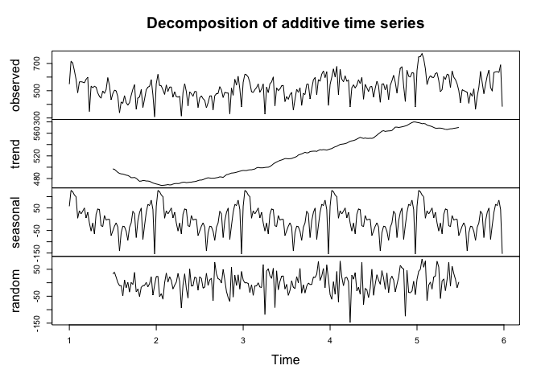

Exploratory Data Analysis
================
Marcelle Chiriboga
2019-05-13

Load the Data
-------------

Our data is composed of two tables:

-   **Exception Hours** (`exception_hours.csv`): contains the data related to exceptions occurred (or scheduled) between 2012 and 2019.

`train.csv` is the training set and it contains the data related to exceptions logged until 2017. It was created from `exception_hours.csv` by running it through the `src/split_train.R` script.

-   **Productive Hours** (`productive_hours.csv`): contains the data related to hours worked from 2010 to present day.

In order to be able to analyze both tables together to compare expections with productive hours, we join both tables to bring the `WORKED_HRS` column into the `exception_hours` table.

``` r
# Aggregate the exceptions by PROGRAM, COST_CENTRE, JOB_FAMILY_DESCRIPTION, SHIFT_DATE, JOB_STATUS
exception_hours_agg <- exception_hours %>% 
  group_by(PROGRAM, COST_CENTRE, JOB_FAMILY_DESCRIPTION,
           SHIFT_DATE, JOB_STATUS) %>% 
  summarise(total_exception_hours = sum(EXCEPTION_HOURS),
            number_of_exceptions = n())

# Join tables
exception_and_productive_hours <- prod_hours %>% 
  left_join(exception_hours_agg, by = c("PROGRAM", "COST_CENTRE",
                                        "JOB_FAMILY_DESCRIPTION", "SHIFT_DATE",
                                        "FULL_PART_TIME" = "JOB_STATUS")) %>% 
  # remove data from 2012, since we don't have exception info for this period
  filter(year(SHIFT_DATE) > 2012)

# Replace NA values with 0
columns <- c("total_exception_hours","number_of_exceptions")
exception_and_productive_hours[columns][is.na(exception_and_productive_hours[columns])] <- 0
```

Exploratory Data Analysis (EDA)
-------------------------------

First, lets focus only on the `exception_hours.csv`, exploring how exceptions are distributed accross some of the variables.

### Exploring the 'exception\_hours' data set

#### `SITE`

``` r
# Check the total number of exceptions by facilities
(facilities <- exception_hours %>% 
  group_by(SITE) %>% 
  filter(SITE %in% c("Billable", "Brock Fahrni", "Holy Family",
                     "Mt St Joseph", "PHC Corporate", "St John Hospice",
                     "St Paul's Hospital", "SVH Honoria Conway", "SVH Langara",
                     "Youville Residence")) %>%
  summarise(count = n()) %>% 
  arrange(desc(count))
 )
```

    ## # A tibble: 10 x 2
    ##    SITE                count
    ##    <chr>               <int>
    ##  1 St Paul's Hospital 420961
    ##  2 Mt St Joseph        83590
    ##  3 Holy Family         37197
    ##  4 SVH Langara         29193
    ##  5 PHC Corporate       24002
    ##  6 Brock Fahrni        19530
    ##  7 Youville Residence  15678
    ##  8 SVH Honoria Conway   2799
    ##  9 St John Hospice      2154
    ## 10 Billable              555

**Observation:**

-   Considering the total number of exceptions from 2013 to 2017, `St Paul's Hospital`, `Mt St Joseph`, `Holy Family` are the top facilities, where `St Paul's Hospital` has ~5x more exceptions than the second facility, `Mt St Joseph`.

**We're focusing on the 10 facilities which include `LABOR_AGREEMENT = NURS`. Do we need to include any others?**

#### `LABOR_AGREEMENT`

``` r
# Rank the total number of exceptions by labor agreement
(labor_agreement <- exception_hours %>% 
  group_by(LABOR_AGREEMENT) %>%
  filter(!(LABOR_AGREEMENT %in% c('NULL', '0'))) %>% 
  summarise(count = n()) %>% 
  arrange(desc(count))
)
```

    ## # A tibble: 5 x 2
    ##   LABOR_AGREEMENT  count
    ##   <chr>            <int>
    ## 1 FAC             331743
    ## 2 NURS            273104
    ## 3 PARMED          117196
    ## 4 EXCL             72624
    ## 5 COM               4588

``` r
# Visualize the total number of exceptions by labor agreement facetting by site
exception_hours %>%
  filter(!(LABOR_AGREEMENT %in% c('NULL', '0')), SITE %in% c("Billable", "Brock Fahrni",
                                                             "Holy Family", "Mt St Joseph",
                                                             "PHC Corporate",
                                                             "St John Hospice",
                                                             "St Paul's Hospital",
                                                             "SVH Honoria Conway",
                                                             "SVH Langara", 
                                                             "Youville Residence")) %>%
  ggplot(aes(x = LABOR_AGREEMENT, fill = LABOR_AGREEMENT)) +
  geom_bar(stat = "count") +
  facet_wrap(~SITE) +
  theme_bw() +
  ggtitle("Number of Exceptions by Labor Agreement per Site (2013 - 2017)") +
  theme(plot.title = element_text(hjust = 0.5)) +
  theme(axis.text.x = element_text(angle = 30, hjust = 0.5, vjust = 0.5)) +
  labs(x = "", y = "Count", fill = "")
```


**Observations:**

-   Considering the total number of exceptions from 2013 to 2017, `FAC`, `NURS` and `PARMED` are the top 3 `LABOR_AGREEMENT`.
-   Most of the exceptions are from `St. Paul's Hospital`, where the majority are related to `NURS`.

**Should we focus only on the top three `LABOR_AGREEMENT`? Or is there value to analyzing all of the groups, even the less representative ones?**

#### `JOB_FAMILY_DESCRIPTION`

Exploring the `JOB_FAMILY_DESCRIPTION` of the main `LABOR_AGREEMENT`:

-   `FAC` job families (top 10)

``` r
# FAC job families
fac_job_family <- exception_hours %>% 
   filter(LABOR_AGREEMENT == "FAC") %>%
   group_by(JOB_FAMILY_DESCRIPTION) %>% 
  summarise(count = n()) %>% 
  arrange(desc(count))

# Print the top 10 FAC job families
head(fac_job_family, 10)
```

    ## # A tibble: 10 x 2
    ##    JOB_FAMILY_DESCRIPTION     count
    ##    <chr>                      <int>
    ##  1 Clerical Other            112789
    ##  2 Care Aide (Resident)       60886
    ##  3 Licensed Practical Nurse   23228
    ##  4 Unit Clerk                 21350
    ##  5 Care Aide (Acute)          18767
    ##  6 Clerical Clinical Support  18682
    ##  7 Porter                     13133
    ##  8 Sterile Supply             11099
    ##  9 Therapy Aide                6237
    ## 10 Clerical Health Records     5761

-   `NURS` job families (top 10)

``` r
# NURS job families
nurs_job_family <- exception_hours %>% 
   filter(LABOR_AGREEMENT == "NURS") %>%
   group_by(JOB_FAMILY_DESCRIPTION) %>% 
  summarise(count = n()) %>% 
  arrange(desc(count))

# Print the top 10 NURS job families
head(nurs_job_family, 10)
```

    ## # A tibble: 10 x 2
    ##    JOB_FAMILY_DESCRIPTION     count
    ##    <chr>                      <int>
    ##  1 Registered Nurse-DC1      228367
    ##  2 Registered Nurse-DC2A Sup  17740
    ##  3 Registered Nurse-DC2B      13511
    ##  4 Licensed Practical Nurse    8573
    ##  5 Registered Nurse-PS2        1659
    ##  6 Registered Nurse-PS1        1024
    ##  7 Registered Nurse-DC3         597
    ##  8 Employed Student Nurse       517
    ##  9 Registered Nurse-CH1         369
    ## 10 Excluded Staff               268

-   `PARMED` job families (top 10)

``` r
# PARMED job families
parmed_job_family <- exception_hours %>% 
   filter(LABOR_AGREEMENT == "PARMED") %>%
   group_by(JOB_FAMILY_DESCRIPTION) %>% 
  summarise(count = n()) %>% 
  arrange(desc(count))

# Print the top 10 PARMED job families
head(parmed_job_family, 10)
```

    ## # A tibble: 10 x 2
    ##    JOB_FAMILY_DESCRIPTION       count
    ##    <chr>                        <int>
    ##  1 Biomedical Engineering Tech  25194
    ##  2 Health Records Administrator 22669
    ##  3 Physiotherapist              11141
    ##  4 Social Worker - MSW          10382
    ##  5 Respiratory Therapist         8285
    ##  6 Occupational Therapist        7233
    ##  7 Other                         5661
    ##  8 Dietitian                     5402
    ##  9 Cardiology Technologist       4397
    ## 10 Diagnostic Services Other     3669

#### `EXCEPTION_GROUP`

-   Considering all sites

``` r
# Check the total number of exceptions by each exception group
(exception_groups <- exception_hours %>% 
  group_by(EXCEPTION_GROUP) %>% 
  summarise(count = n()) %>% 
  arrange(desc(count))
 )
```

    ## # A tibble: 15 x 2
    ##    EXCEPTION_GROUP           count
    ##    <chr>                     <int>
    ##  1 Other                    217748
    ##  2 Vacation                 143861
    ##  3 Paid Sick                 84793
    ##  4 Swap                      83024
    ##  5 Workload                  71522
    ##  6 Vacancy                   55165
    ##  7 Leave of Absence          41889
    ##  8 Move                      23887
    ##  9 Casual Sick or Cancelled  23357
    ## 10 Unpaid Sick               12875
    ## 11 On Call & Call Back       10968
    ## 12 Work Related Injury        9990
    ## 13 Schedule Adjustment        8646
    ## 14 Education                  7415
    ## 15 Relief Sick                4156

Most exceptions fall under`Other`. Let's look at those to see what are some of the exception reasons associated under this group.

``` r
# Check the total number of `Other` exceptions by each exception reason
other_exception_reason <- exception_hours %>% 
  filter(EXCEPTION_GROUP == "Other") %>% 
  group_by(EXCEPTION_REASON) %>% 
  summarise(count = n()) %>% 
  arrange(desc(count))

head(other_exception_reason, 10)
```

    ## # A tibble: 10 x 2
    ##    EXCEPTION_REASON                 count
    ##    <chr>                            <int>
    ##  1 REG- Regular Hrs - MV- Move      34167
    ##  2 PVC- Vacation Regular - MV- Move 29473
    ##  3 REG- Regular Hrs                 24293
    ##  4 FTE- Flex Time Earned NC         22000
    ##  5 Vacant Shift - MV- Move          13445
    ##  6 OGX- OT Meeting 1x               12207
    ##  7 PSK- Sick Lv - MV- Move           6398
    ##  8 REG- Wkld Increase - MV- Move     6188
    ##  9 Swap shifts - MV- Move            3605
    ## 10 ODO- OT on a day off (paid        3423

-   Focusing on `St Paul's Hospital` `EXCEPTION_GROUP` to check if the main groups are the same as the ones considering PHC as a whole.

``` r
# Check the St Pauls Hospital total number of exceptions by each exception group
(exception_groups_st_paul <- exception_hours %>% 
  filter(SITE == "St Paul's Hospital") %>% 
  group_by(EXCEPTION_GROUP) %>% 
  summarise(count = n()) %>% 
  arrange(desc(count))
)
```

    ## # A tibble: 15 x 2
    ##    EXCEPTION_GROUP           count
    ##    <chr>                     <int>
    ##  1 Other                    117314
    ##  2 Vacation                  69348
    ##  3 Swap                      46102
    ##  4 Workload                  42917
    ##  5 Paid Sick                 39606
    ##  6 Vacancy                   32106
    ##  7 Leave of Absence          22229
    ##  8 Move                      14271
    ##  9 Casual Sick or Cancelled  10103
    ## 10 Unpaid Sick                6444
    ## 11 Schedule Adjustment        5503
    ## 12 On Call & Call Back        4651
    ## 13 Education                  4419
    ## 14 Work Related Injury        3981
    ## 15 Relief Sick                1967

``` r
# Check the St Paul's Hospital total number of `Other` exceptions by each exception reason
other_exception_reason_st_paul <- exception_hours %>% 
  filter(SITE == "St Paul's Hospital" & EXCEPTION_GROUP == "Other") %>% 
  group_by(EXCEPTION_REASON) %>% 
  summarise(count = n()) %>% 
  arrange(desc(count))

head(other_exception_reason_st_paul, 10)
```

    ## # A tibble: 10 x 2
    ##    EXCEPTION_REASON                 count
    ##    <chr>                            <int>
    ##  1 FTE- Flex Time Earned NC         17428
    ##  2 REG- Regular Hrs - MV- Move      16691
    ##  3 PVC- Vacation Regular - MV- Move 14307
    ##  4 REG- Regular Hrs                 12837
    ##  5 Vacant Shift - MV- Move           8947
    ##  6 OGX- OT Meeting 1x                7275
    ##  7 REG- Wkld Increase - MV- Move     3603
    ##  8 PSK- Sick Lv - MV- Move           3052
    ##  9 BGX- OT Bank Meeting 1x           2315
    ## 10 REG- Working Off Site             1964

**Observations:**

Top `EXCEPTION_GROUP` by number of exceptions:

-   PHC as a whole: `Other` &gt; `Vacation` &gt; `Paid Sick` &gt; `Swap`
-   `St. Paul’s Hospital`: `Other` &gt; `Vacation` &gt; `Swap` &gt; `Workload`

Top `EXCEPTION_REASON` related to `Other` `EXCEPTION_GROUP`:

-   PHC as a whole: `REG- Regular Hrs - MV- Move`, `PVC- Vacation Regular - MV- Move`, `REG- Regular Hrs`, `FTE- Flex Time Earned NC`
-   `St. Paul’s Hospital`: `FTE- Flex Time Earned NC`, `REG- Regular Hrs - MV- Move`, `PVC- Vacation Regular - MV- Move`, `REG- Regular Hrs`

**Given `Other` is the top 1 `EXCEPTION_GROUP`, and since the `EXCEPTION_REASON` associated seem to, in several cases, fit into one or more of the other existing `EXCEPTION_GROUP`, should we attempt to recategorize some of these exceptions?**

### St Paul's Hospital - Vacation

Analyze `Vacation` and Sickness ('Paid Sick', 'Unpaid Sick', 'Relief Sick') `EXCEPTION_GROUP` from `St Paul's Hospital`.

``` r
# Create a dataset for St Paul's Hospital Vacation
(vacation_weekly <- exception_hours %>% 
  filter(SITE == "St Paul's Hospital", EXCEPTION_GROUP == 'Vacation') %>% 
  # extract year and week
  mutate(year = year(SHIFT_DATE),
         week = week(SHIFT_DATE)) %>% 
  group_by(year, week) %>%
  summarise(count = n()) %>% 
  # remove the last week of each year (week 53), since they consider few days
  filter(week != 53)
)
```

    ## # A tibble: 260 x 3
    ## # Groups:   year [5]
    ##     year  week count
    ##    <dbl> <dbl> <int>
    ##  1  2013     1   296
    ##  2  2013     2   172
    ##  3  2013     3   134
    ##  4  2013     4   126
    ##  5  2013     5   137
    ##  6  2013     6   142
    ##  7  2013     7   198
    ##  8  2013     8   174
    ##  9  2013     9   128
    ## 10  2013    10   150
    ## # … with 250 more rows

``` r
# Create a dataset for sick
(sick_weekly <- exception_hours %>% 
  filter(SITE == "St Paul's Hospital",
         EXCEPTION_GROUP %in% c('Paid Sick', 'Unpaid Sick', 'Relief Sick')) %>% 
    # extract year and week
  mutate(year = year(SHIFT_DATE),
         week = week(SHIFT_DATE)) %>% 
  group_by(year, week) %>%
  summarise(count = n()) %>% 
  # remove the last week of each year (week 53), since they consider few days
  filter(week != 53)
)
```

    ## # A tibble: 260 x 3
    ## # Groups:   year [5]
    ##     year  week count
    ##    <dbl> <dbl> <int>
    ##  1  2013     1   199
    ##  2  2013     2   241
    ##  3  2013     3   271
    ##  4  2013     4   235
    ##  5  2013     5   189
    ##  6  2013     6   153
    ##  7  2013     7   187
    ##  8  2013     8   227
    ##  9  2013     9   227
    ## 10  2013    10   187
    ## # … with 250 more rows

``` r
# Create daily time series for different exception groups
ts_vacation_weekly <- ts(vacation_weekly$count, frequency = 52)
ts_sick_weekly <- ts(sick_weekly$count, frequency = 52)

# Plot the time series
plot(ts_vacation_weekly, xlab = "Year", ylab = "Number of Exceptions", 
     main = "Number of Exceptions (Vacation) per Week")
```


``` r
plot(ts_sick_weekly, xlab = "Year", ylab = "Number of Exceptions", 
     main = "Number of Exceptions (Sickness) per Week")
```


``` r
dec_ts_vacation_weekly <- decompose(ts_vacation_weekly)
dec_ts_sick_weekly <- decompose(ts_sick_weekly)

# Plot the decompositions
# Vacation
plot(dec_ts_vacation_weekly)
```


``` r
# Sickness
plot(dec_ts_sick_weekly)
```



**Observations:**

Looking at the trend components for both vacation and sickness we notice:

-   Vacation decreases significantly in 2014 and continues with a smaller trend in 2015, picking up again in 2016
-   Sickness shows a slight initial trend decrease, followed by an increase over the years.

Let's explore now the data for both Exception and Productive Hours

#### Exception vs. Productive Hours

Considering first Providence Health Care as a whole, not making any distinction among facilities, program, and job families, for example.

Analyze the exceptions occurred from 2013 to 2017, contrasting them with the productive hours in order to see if there is a correlation between them.

-   **Monthly Analysis**

``` r
# Create a data set considering a monthly basis
excep_prod_hours_monthly <- exception_and_productive_hours %>%
  # Consider the same window of the training set - data from 2013 to 2017
  filter(year(SHIFT_DATE) < 2018) %>% 
  # extract year and month
  mutate(year = year(SHIFT_DATE),
         month = month(SHIFT_DATE)) %>% 
  group_by(year, month) %>% 
  summarise(prod_hours = sum(WORKED_HRS), 
            excep_hours = sum(total_exception_hours),
            total_exceptions = sum(number_of_exceptions))
```

``` r
# Create monthly time series
ts_prod_hours_monthly <- ts(excep_prod_hours_monthly$prod_hours, frequency = 12)
ts_excep_hours_monthly <- ts(excep_prod_hours_monthly$excep_hours, frequency = 12)
ts_excep_number_monthly <- ts(excep_prod_hours_monthly$total_exceptions, frequency = 12)
```

``` r
# Plot the time series
ts.plot(ts_prod_hours_monthly, ts_excep_hours_monthly, 
        main = "Productive vs. Exceptions Hours (monthly)", xlab = "Year", ylab = "Hours")
```


``` r
plot(ts_prod_hours_monthly, main = "Productive Hours (monthly)", xlab = "Year", ylab = "Hours")
```


``` r
plot(ts_excep_hours_monthly, main = "Exceptions Hours (monthly)", xlab = "Year", ylab = "Hours")
```


``` r
plot(ts_excep_number_monthly, main = "Number of Exceptions (monthly)", 
     xlab = "Year", ylab = "Number of Exceptions")
```


``` r
# Plot the decompositions
# Productive hours
dec_ts_prod_hours_monthly <- decompose(ts_prod_hours_monthly)
plot(dec_ts_prod_hours_monthly)
```


``` r
# Exception hours
dec_ts_excep_hours_monthly <- decompose(ts_excep_hours_monthly)
plot(dec_ts_excep_hours_monthly)
```


``` r
# Total number of exceptions
dec_ts_excep_number_monthly <- decompose(ts_excep_number_monthly)
plot(dec_ts_excep_number_monthly)
```


-   **Weekly Analysis**

``` r
# Create a data set considering a weekly basis
excep_prod_hours_weekly <- exception_and_productive_hours %>%
  # Consider the same window of the training set - data from 2013 to 2017
  filter(year(SHIFT_DATE) < 2018) %>% 
  # extract year and week
  mutate(year = year(SHIFT_DATE),
         week = week(SHIFT_DATE)) %>% 
  group_by(year, week) %>% 
  summarise(prod_hours = sum(WORKED_HRS),
            excep_hours = sum(total_exception_hours),
            total_exceptions = sum(number_of_exceptions)) %>% 
  # remove the last week of each year (week 53), since they consider few days
  filter(week != 53)
```

``` r
# Create weekly time series
ts_prod_hours_weekly <- ts(excep_prod_hours_weekly$prod_hours, 
                           start = c(2013, 1), 
                           frequency = 52)
ts_excep_hours_weekly <- ts(excep_prod_hours_weekly$excep_hours,
                            start = c(2013, 1), 
                            frequency = 52)
ts_excep_number_weekly <- ts(excep_prod_hours_weekly$total_exceptions, 
                             start = c(2013, 1), 
                             frequency = 52)

# Plot the time series
ts.plot(ts_prod_hours_weekly, 
        ts_excep_hours_weekly,
        main = "Productive Hours vs. Number of Exceptions - weekly")
```


``` r
plot(ts_prod_hours_weekly, 
     main = "Productive Hours (weekly)", 
     xlab = "Year", 
     ylab = "Hours")
```


``` r
plot(ts_excep_hours_weekly, 
     main = "Exceptions Hours (weekly)", 
     xlab = "Year", 
     ylab = "Hours")
```


``` r
plot(ts_excep_number_weekly, 
     main = "Number of Exceptions (weekly)", 
     xlab = "Year", 
     ylab = "Number of Exceptions")
```


``` r
# Plot the decompositions
# Productive hours
dec_ts_prod_hours_weekly <- decompose(ts_prod_hours_weekly)
plot(dec_ts_prod_hours_weekly)
```


``` r
# Exception hours
dec_ts_excep_hours_weekly <- decompose(ts_excep_hours_weekly)
plot(dec_ts_excep_hours_weekly)
```


``` r
# Total number of exceptions
dec_ts_excep_number_weekly <- decompose(ts_excep_number_weekly)
plot(dec_ts_excep_number_weekly)
```


**Observations:**

-   All analyses (monthly and weekly for productive hours, exception hours and number of exceptions) indicate an increasing trend over the years.
-   The weekly analyses show that the seasonal component has a trough every year during week 52, i.e. much lower numbers for productive hours, exception hours and number of exceptions in comparison to other surrounding weeks.

``` r
excep_prod_hours_weekly %>% 
  filter(week %in% c(50, 51, 52, 1, 2), !(week %in% c(1, 2) & year == 2013))
```

    ## # A tibble: 23 x 5
    ## # Groups:   year [5]
    ##     year  week prod_hours excep_hours total_exceptions
    ##    <dbl> <dbl>      <dbl>       <dbl>            <dbl>
    ##  1  2013    50     45577.       4818.              596
    ##  2  2013    51     42356.       4766.              574
    ##  3  2013    52     29639.       4011.              467
    ##  4  2014     1     39126.       4414.              531
    ##  5  2014     2     47063.       4602.              583
    ##  6  2014    50     46329.       5370.              699
    ##  7  2014    51     42251.       5131.              619
    ##  8  2014    52     30295.       3977.              469
    ##  9  2015     1     40492.       4360.              526
    ## 10  2015     2     47767.       4658.              608
    ## # … with 13 more rows

-   At a glance, the expectation would be for weeks with lower productive hours to have higher exceptions (number and/or hours). However, this doesn't seem to be true for week 52, as all values are lower than other weeks.

**Do holidays play a part in this? That is, do weeks that have holidays have lower productive hours, but also lower exceptions? Are holidays not taken into account in exceptions?**
